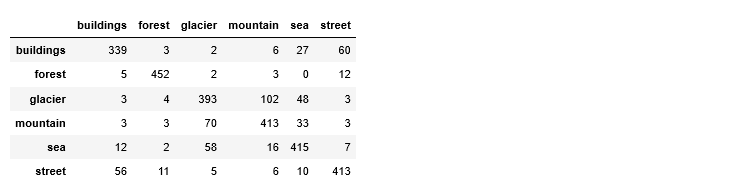
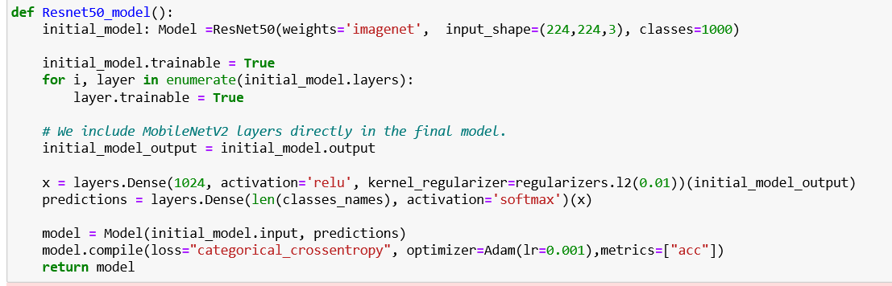
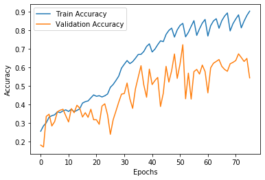

# Image-Classification-of-categories-Building_forest_glacier_mountain_sea_street-using-keras
Image Classification of categories [Building, forest, glacier, mountain, sea, street]

Download the full dataset from here [https://www.dropbox.com/s/j63xk9aopi58ifk/Image%20Classification%20of%20categories%20%5BBuilding%2C%20forest%2C%20glacier%2C%20mountain%2C%20sea%2C%20street%5D.zip?dl=0](https://www.dropbox.com/s/j63xk9aopi58ifk/Image%20Classification%20of%20categories%20%5BBuilding%2C%20forest%2C%20glacier%2C%20mountain%2C%20sea%2C%20street%5D.zip?dl=0)

## 1.	Load the data set: 
The dataset consists of six classes with 14034 training and 3000 testing examples. The split ratio of each classes shown below:

 
I have read the images using opencv and resize them 224*224*3, so that we can also use them in pretrained imagenet model. Final loaded Dataset is saved in numpy array that could be use able in the training time.

We have visualized first 18 images to check the different categories images in the dataset.

## 2.	Perform Image Augmentation:
I have performed Randomly five type of data augmentation techniques on images which are describes below:

    	Random Rotate: Randomly rotating image in clock and anti-clockwise direction
    	Horizontal Flip: Flipping the image in Horizontal Direction
    	Random Noise: Adding Random Noise in the image
    	Blurring: Adding blurring through gaussian filter.
    	Translation Wrapping: Translating specific part of image and placing it in the other part.
    
Below function read the image and then apply one of these data augmentation technique Randomly.

3 images examples are shown below that how these augmentation effect on image.

## 3.	Build your Convolutional Neural Network:
I have tried developing multiple models using different cnn layers features and different hyper parameters. Some of model architecture are explained below:
### 3.1	 Model1
The first model that I have tried has 8 layers of cnn with different combination of max pooling, batch normalization and Dropout. At the we flatten the cnn layer and use 2 dense layers. We have used inception model style of layers as well to further capture features with different kernel sizes. We have use relu activation function in Dense layers and softmax function in last Dense layers. Softmax help us to generate probabilites of each class at the end, in it we try to maximize the probabilities. We have used categorical_crossentropy loss function because we have 10 number of classes at the end, in which all entries are 0 except the correspondene class is 1. 

#### a.	Model1 Architecture visualization:

    from keras.utils import plot_model    
    plot_model(model1, show_shapes=True,to_file='model1.png')

#### b.	Model1 Compiling and Results:
##### i.	Model Compiling:
We have use Adam Optimizer and Train the model for 80 epochs in total dataset. Note that we are loading the dataset in chunks because it takes a lot of Ram in system memory.

##### ii.	Train Validation Accuracy and Train Validation Loss comparison:
The results show that model is not overfitting on training data, it reach maximum 80 accuracy on training data. But validation loss is quite more than training loss. We use matplotlib library to plot the accuracy and loss graph.

##### iii.	Accuracy on Test Data:
We have received 80% Accuracy on Test images of 3000. We are using sklearn library to measure the accuracy from model prediction.

##### iv.	Confusion Matric on Test Data:
In the confusion matric we can see that most street case are classified as buildings as there are some similarity between them. And glacier is some classifies as mountain because of some similarity.

### 3.2.	Model2: Redo steps 3 and 4 with different structures and different values of the hyperparameters:

Our First model has less number of training parameters, so the next model I have created so that it has specific number of parameters that can learns more features. The 2nd model that I have tried has 9 layers of cnn with different combination of max pooling, batch normalization and Dropout. At the we flatten the cnn layer and use 2 dense layers. We have use relu activation function in Dense layers and softmax function in last Dense layers.

#### a.	Model2 Architecture visualization: 
    from keras.utils import plot_model
    plot_model(model2, show_shapes=True,to_file='model2.png')

 
#### b.	Model2 Results:
##### i.	Model Compiling:
We have use Adam Optimizer and Train the model for 80 epochs in total dataset. Note that we are loading the dataset in chunks because it takes a lot of Ram in system memory.

##### ii.	Train Validation Accuracy and Train Validation Loss comparison:
The results show that model is not overfitting on training data, it reaches maximum 80 accuracy on training data. But validation loss is quite more than training loss. We use matplotlib library to plot the accuracy and loss graph.

##### iii.	Accuracy on Test Data:
We have received 78.2% Accuracy on Test images of 3000. We are using sklearn library to measure the accuracy from model prediction.

##### iv.	Confusion Matric on Test Data:
In the confusion matric we can see that most street case are classified as buildings as there are some similarity between them. And glacier is some classifies as mountain because of some similarity. 

 
## 4.	 Save your Final Model:
Model1 performs better than the model2 so we have saved it weights.
Classifier/Model|	Accuracy
--- | ---
Model1|	80.83
Model2|	78.2

 
## 5.	Use your model with your own photos:
Testing it using Model1 as it has given good accuracy on testing data. We have download 6 images of different classes from internet and we use those images to test the model. Note that those images are never seen by model.

Results:

## 6.	Bonus: use a pre-trained model like ResNet to improve your results.:
We have tried pretrained Resnet50 model that has trained on imagenet dataset. The model output 1000 neurons at the output, we have connected 2 more dense layers at the end to narrow down the output to 6 classes. We have used softmax at the last layer and cateogircal_crossentropy loss at the end. 
The benefit of using pretrained model that its train faster on similar data, and converge to optimal in less time. 

 

### a.	Resnet50 Architecture visualization: 
Resnet is quite deep network structure in which input of one layer before cnn operation added to the output to avoid feature loss. The structure of resnet shown below:
 

### b.	Resnet50 Results:
#### i.	Train Validation Accuracy and Train Validation Loss comparison:
The results show that model is not overfitting on training data, it reaches maximum 80 accuracy on training data. But validation loss is quite more than training loss. We use matplotlib library to plot the accuracy and loss graph.

#### ii.	Accuracy on Test Data:
We have received 87.4% Accuracy on Test images of 3000. We are using sklearn library to measure the accuracy from model prediction.
 
iii.	Confusion Matric on Test Data:
In the confusion matric we can see that most street case are classified as buildings as there are some similarity between them. And glacier is some classifies as mountain because of some similarity. 

 
 

### c.	Testing on Own Images Using Resnet Model:
#### i.	Experimental Results
Accuracy score comparison of different models is shown below: 
Classifier/Model|	Accuracy
--- | ---
Model1|	80.83
Model2|	78.2
Resnet50|	87.4

So first Resnet50 model is perform quite good. So we tested the results using it. These are not the images that were part of dataset. They were downloaded from google images and I have used them.

ii.	Results:

